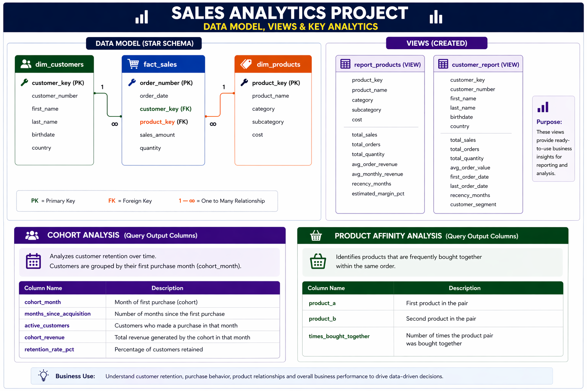

# Advanced SQL Sales Analytics



---

## 📌 Overview

This project demonstrates advanced SQL-based analytics on sales data to uncover insights related to customer behavior, product performance, and overall business trends.

The project follows a structured **data warehouse approach** using a star schema and focuses on solving real business problems using SQL.

---

## 🛠️ Key Work Done

* Performed **Exploratory Data Analysis (EDA)** to understand data structure and quality 
* Built a **star schema data model** using fact and dimension tables
* Created **analytical views** for customer and product reporting
* Performed **time-series analysis**, running totals, and moving averages 
* Implemented **customer segmentation and RFM analysis**
* Built **product performance analysis with KPIs and YoY trends** 

---

## 🗂️ Data Model

The project uses a **star schema design**:

* **fact_sales** → transactional sales data
* **dim_customers** → customer information
* **dim_products** → product details

This structure enables efficient aggregation and analytical querying.

---

## 📊 Views Created

### 🔹 report_products (VIEW)

A product-level analytical view that provides:

* total_sales
* total_orders
* total_quantity
* total_customers
* avg_order_revenue
* avg_monthly_revenue
* recency_months
* estimated_margin_pct
* product_performance segmentation

👉 Built using aggregation and KPI logic 

---

### 🔹 report_customers (VIEW)

A customer-level analytical view that provides:

* total_sales
* total_orders
* total_quantity
* total_products
* avg_order_value
* avg_monthly_spend
* recency_months
* customer_segment (VIP / REGULAR / NEW)
* age_group

👉 Includes behavioral segmentation and lifecycle metrics 

---

## 📁 Advanced Analysis (Separate SQL Files)

To maintain modularity, advanced analyses are implemented in separate SQL scripts:

---

### 🔹 RFM Analysis

Customer segmentation based on:

* **Recency** → months since last purchase
* **Frequency** → number of orders
* **Monetary** → total spending

Customers are scored and segmented into:

* Champion
* Loyal
* At Risk
* Lost

👉 Helps identify high-value customers and retention opportunities

---

### 🔹 Cohort Analysis

Analyzes customer retention based on acquisition month.

**Columns:**

* cohort_month
* months_since_acquisition
* active_customers
* cohort_revenue
* retention_rate_pct

👉 Helps evaluate retention quality and customer lifecycle performance

---

### 🔹 Product Affinity Analysis

Identifies products frequently purchased together.

**Columns:**

* product_a
* product_b
* times_bought_together

👉 Supports cross-selling, bundling, and recommendation strategies

---

## 🧠 SQL Concepts Used

* CTEs (Common Table Expressions)
* Window Functions (LAG, NTILE, SUM OVER, AVG OVER)
* Aggregations (SUM, COUNT, AVG)
* CASE statements for segmentation
* Joins (Fact & Dimension tables)
* Date functions (DATEDIFF, DATETRUNC, DATEPART)
* View creation for reusable reporting

---

## 💡 Key Insights

* Revenue trends show clear time-based patterns
* A small group of customers contributes a large portion of total revenue
* RFM analysis helps identify high-value and at-risk customers
* Retention analysis highlights long-term customer behavior
* Product affinity reveals cross-selling opportunities

---

## 📁 Project Structure

```text id="sqy9m2"
SQL/
 ├── eda.sql
 ├── time_series_analysis.sql
 ├── customer_analysis.sql
 ├── product_analysis.sql
 ├── rfm_analysis.sql
 ├── cohort_analysis.sql
 ├── product_affinity.sql
```

## 📈 Summary

This project demonstrates how SQL can be used to build a complete analytical solution — from data exploration to advanced analytics like RFM, cohort analysis, and product affinity — delivering meaningful business insights.
