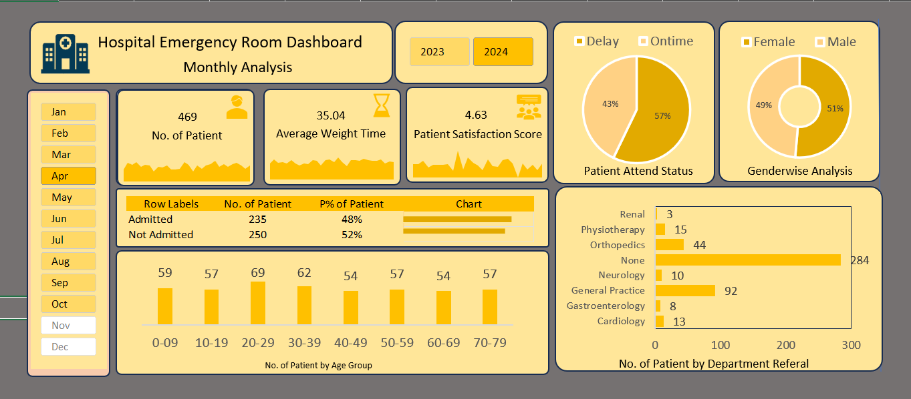

# 🏥 Hospital Emergency Room Analysis Dashboard

## 📊 Dashboard Preview

## 📌 Project Overview

This project focuses on analyzing hospital emergency room data to improve operational efficiency and patient experience.

The goal is to transform raw data into meaningful insights that help stakeholders monitor performance and make better decisions.

---

## 🎯 Business Problem

Hospitals handle a large number of patients daily, but without proper analysis, it is difficult to:

* Track patient flow
* Monitor wait times
* Evaluate service quality
* Identify operational inefficiencies

---

## 🧰 Tools Used

* Excel
* Power Query
* Pivot Tables
* Dashboarding

---

## ⚙️ Project Workflow

1. Data Import using Power Query
2. Data Cleaning and Transformation
3. Calendar Table Creation
4. Data Modeling
5. KPI Calculation
6. Pivot Table Analysis
7. Dashboard Development
8. Insights Generation

---

## 📊 Key KPIs

* Number of Patients
* Average Wait Time
* Patient Satisfaction Score

---

## 📈 Dashboard Insights

* Peak patient days identified through trend analysis
* Average wait time highlights operational delays
* Patient satisfaction varies based on service efficiency
* Certain departments receive higher referrals

---

## 🚀 Conclusion

This project demonstrates end-to-end data analysis from raw data processing to dashboard creation and business insight generation.
