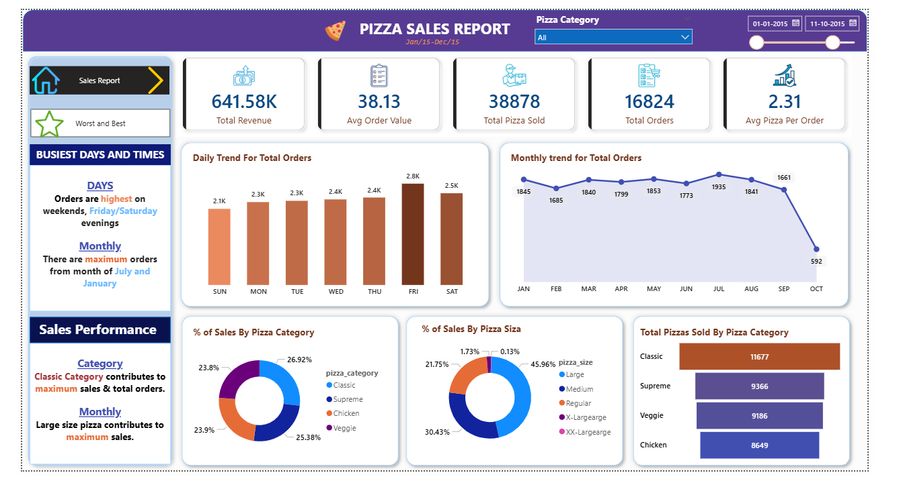
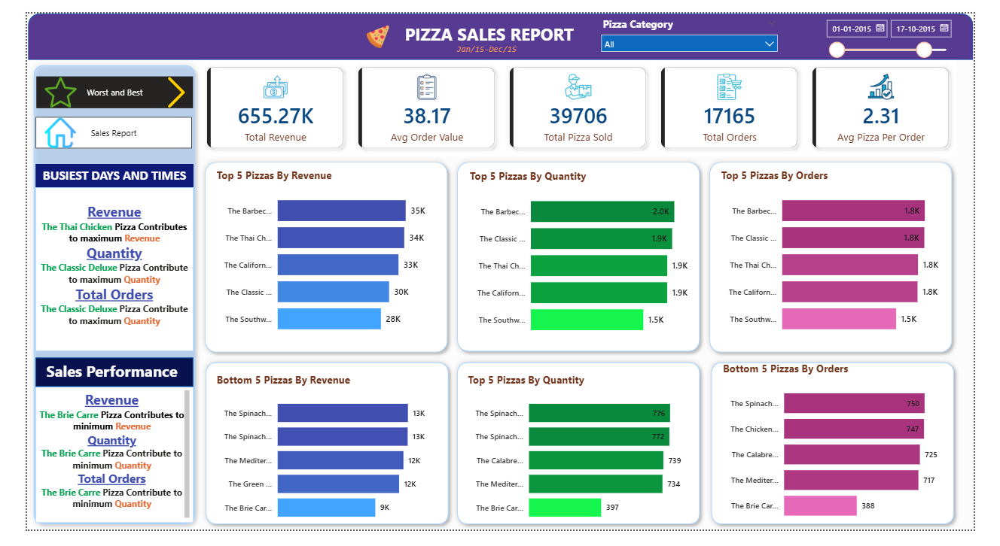

# 🍕 Pizza Sales Analysis Dashboard

## 📊 Dashboard Preview

## 📌 Overview

In this project, I analyzed pizza sales data using SQL and Power BI to understand sales performance, customer behavior, and product trends.

---

## 🛠️ What I Did

* First, I used SQL (SSMS) to query the data and calculate key metrics like total sales, category-wise sales, and order trends
* Then, I imported the data into Power BI
* Used Power Query to clean and prepare the data
* Created DAX measures like:

  * Total Revenue
  * Total Orders
  * Total Pizzas Sold
  * Average Order Value
* Finally, built an interactive dashboard

---

## 📊 Dashboard Explanation

### 🔹 KPI Cards

* **Total Revenue** → shows overall sales (~641K)
* **Total Orders** → total number of orders (~16K)
* **Total Pizzas Sold** → total quantity (~38K)
* **Average Order Value** → average spend per order (~38)
* **Avg Pizzas per Order** → around 2–3 pizzas per order

---

### 🔹 Sales Trends

* **Daily Trend Chart** → shows how orders change day by day
* **Monthly Trend Chart** → helps identify peak months (July, January)

---

### 🔹 Category & Size Analysis

* **Sales by Category (Bar Chart)**
  → Classic category generates highest revenue

* **Sales by Pizza Size (Donut/Bar Chart)**
  → Large pizzas contribute the most to revenue

---

### 🔹 Product Performance

* **Top 5 Pizzas**
  → Shows best-performing pizzas by revenue and quantity

* **Bottom 5 Pizzas**
  → Identifies low-performing products

---

## 📈 Key Insights

* Sales are highest on **weekends (Friday & Saturday)**
* **Evening time** has more orders
* **Classic category** performs best
* **Large pizzas** generate maximum revenue
* Customers usually order **2–3 pizzas per order**

---

## 📁 Project Structure

Data → Raw dataset
Dashboard → Power BI file
Images → Dashboard screenshots
SQL → Queries used

---

## 🚀 How to Use

Download the Power BI file and open it in Power BI Desktop to explore the dashboard.

---

