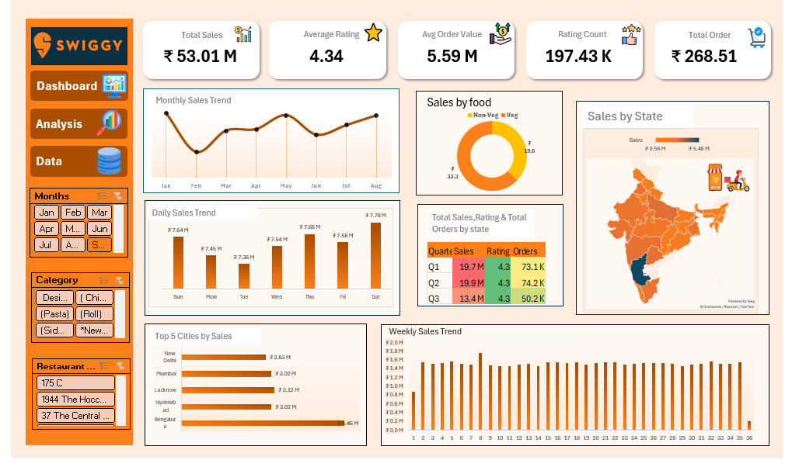

# 🍽️ Swiggy Sales Analysis Dashboard

## 📸 Dashboard Preview

## 📊 Project Overview
This project presents an interactive Excel dashboard analyzing Swiggy sales data to uncover insights related to order trends, revenue performance, and customer behavior.

The dashboard helps in understanding business performance across different cities, time periods, and food categories.

---

## 🎯 Objectives
- Analyze total sales and order trends
- Identify top-performing cities and food categories
- Understand daily, weekly, and monthly sales patterns
- Evaluate key performance metrics for decision-making

---

## 🛠️ Tools & Technologies
- MS Excel
- Pivot Tables
- Charts & Visualizations
- Slicers (Interactive Filters)

---

## 📌 Key Metrics
- Total Sales: ₹53.01M
- Total Orders: 197.43K
- Average Rating: 4.34
- Average Order Value: ₹268.51

---

## 📈 Dashboard Features
- Monthly, Weekly, and Daily Sales Trends
- City-wise and State-wise Sales Analysis
- Category-wise (Veg/Non-Veg) Distribution
- Top 5 Cities by Sales
- Interactive Filters (Months, Category, Restaurant)

---

## 🔍 Key Insights
- Certain cities contribute significantly to total revenue
- Peak sales observed on weekends
- Veg vs Non-Veg distribution shows customer preference trends
- Sales fluctuate based on time and location patterns

---

